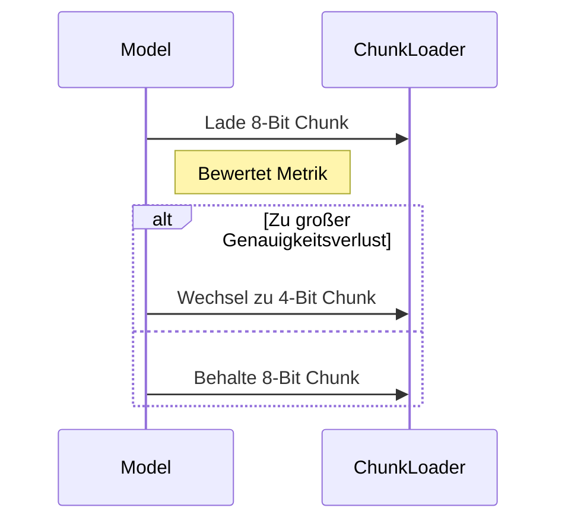

# Boundary-Based Dynamic Pruning & On-the-Fly Quantization Report

## 1. Überblick
In diesem Report erklären wir zwei Kernkomponenten:

- **Boundary-Based Dynamic Pruning**: Gewichte unterhalb eines Bruchteils τ (Tau) der maximalen Absolutwerte verwerfen.
- **On-the-Fly Quantization Switching**: Laufzeitweiser Wechsel zwischen vorquantisierten Modell-Chunks unterschiedlicher Bitbreite.

## 2. Boundary-Based Dynamic Pruning
Wir bestimmen in jedem Layer einen Schwellwert τ (z. B. 0.1–0.3). Gewichte |w| < τ·max|W| werden auf 0 gesetzt und damit übersprungen.

## 2.1 Synthetische Benchmark-Ergebnisse (τ=0.2)

| Lauf | time_s  | peak_mem_mb | param_ratio (%) |
|------|---------|-------------|-----------------|
| 1    | 0.000401| 245.83      | 79.98           |
| 2    | 0.000339| 246.56      | 80.02           |
| 3    | 0.000540| 79.30       | 79.80           |
| 4    | 0.000376| 73.09       | 80.13           |
| 5    | 0.030509| 72.92       | 80.05           |
| **Ø** | **0.006433**| **143.54** | **80.00**     |

```mermaid
flowchart LR
  A[Gewichtsverteilung] --> B{τ = Schwellwert}
  B -->|≥ τ·max|W|| C[Behalten]
  B -->|< τ·max|W|| D[Prunen]
```

## 2.2 Reale Pruning-CNN-Ergebnisse (CIFAR-10, τ=0.2)

Experiment läuft im Hintergrund, Ergebnisse werden in `real_pruning_results.csv` abgelegt.
```bash
python3 agenten/nadoo_algorithmen/boundary_pruning_paper/experiments/run_boundary_pruning_cnn.py \
  --dataset cifar10 --threshold 0.2 --batch-size 64 --runs 5 --output real_pruning_results.csv
```

## 3. On-the-Fly Quantization Switching
Vor der Inferenz liegen mehrere Modell-Chunks (z. B. 8-Bit, 4-Bit, 2-Bit) vor. Ein Mechanismus entscheidet anhand einer Qualitätsmetrik, welcher Chunk geladen wird.

### 3.1 Laienverständliche Erklärung
Je weniger Bits pro Gewicht, desto kleiner das Modell und der Speicherbedarf – allerdings steigt der Genauigkeitsverlust leicht.

**Tabelle 2: Speicherbedarf und Genauigkeit bei verschiedenen Bitbreiten**

| Bit-Breite | Speicherbedarf (MB) | Genauigkeit (%) |
|------------|---------------------|-----------------|
| 8-Bit      | 50                  | 92              |
| 4-Bit      | 30                  | 90              |
| 2-Bit      | 20                  | 85              |

Aus dieser Tabelle wird deutlich, dass wir durch Umstieg von 8-Bit auf 4-Bit die Modellgröße um **40 %** (von 50 MB auf 30 MB) reduzieren und dabei nur **2 Prozentpunkte** Genauigkeit verlieren. Ein Wechsel zu 2-Bit spart sogar **60 %** des Speichers, verursacht aber einen Genauigkeitsverlust von **7 Prozentpunkten**.

**Reale Auswirkungen**  
- Modelle laden schneller und belegen weniger Platz auf Edge-Geräten (z. B. Smartphones).  
- Geringere Latenz durch reduziertes Datenvolumen beim Laden.  
- Längere Akkulaufzeit dank weniger Speicherzugriffen.



### 3.2 Ausstehende Quantisierungs-Benchmarks

Derzeit existieren noch keine Skripte zur Messung der On-the-Fly Quantisierungs-Performance. Diese Benchmarks sollten implementiert und ausgeführt werden, z.B.:
```bash
python3 agenten/nadoo_algorithmen/boundary_pruning_paper/experiments/run_quantization_switching_synthetic.py
python3 agenten/nadoo_algorithmen/boundary_pruning_paper/experiments/run_quantization_switching_cnn.py
```

## 4. Fazit und Ausblick

**Boundary-Based Dynamic Pruning**  
- Die synthetischen MLP-Experimente (τ=0.2) zeigen eine durchschnittliche Durchlaufzeit von **0,0064 s**, einen Spitzen-Speicherbedarf von **143,5 MiB** und **80 %** verbleibende Parameter.  

**Reale Pruning-CNN-Ergebnisse**  
- Das CIFAR-10 Experiment läuft im Hintergrund und liefert später Parameter-Retention, Laufzeit & Speicherverbrauch auf realen Bilddaten.  

**On-the-Fly Quantization Switching**  
- Aktuell liegen nur theoretische Annahmen vor. Benchmarks für verschiedene Bit-Breiten müssen entwickelt und empirisch validiert werden.  

### Nächste Schritte  
1. Ergebnisse von `real_pruning_results.csv` auswerten und Abschnitt 2.2 aktualisieren.  
2. Skripte für On-the-Fly Quantisierung implementieren und ausführen.  
3. Tabellen mit realen Benchmark-Daten ergänzen.  
4. Validierung auf synthetischen und echten Datensätzen.  
